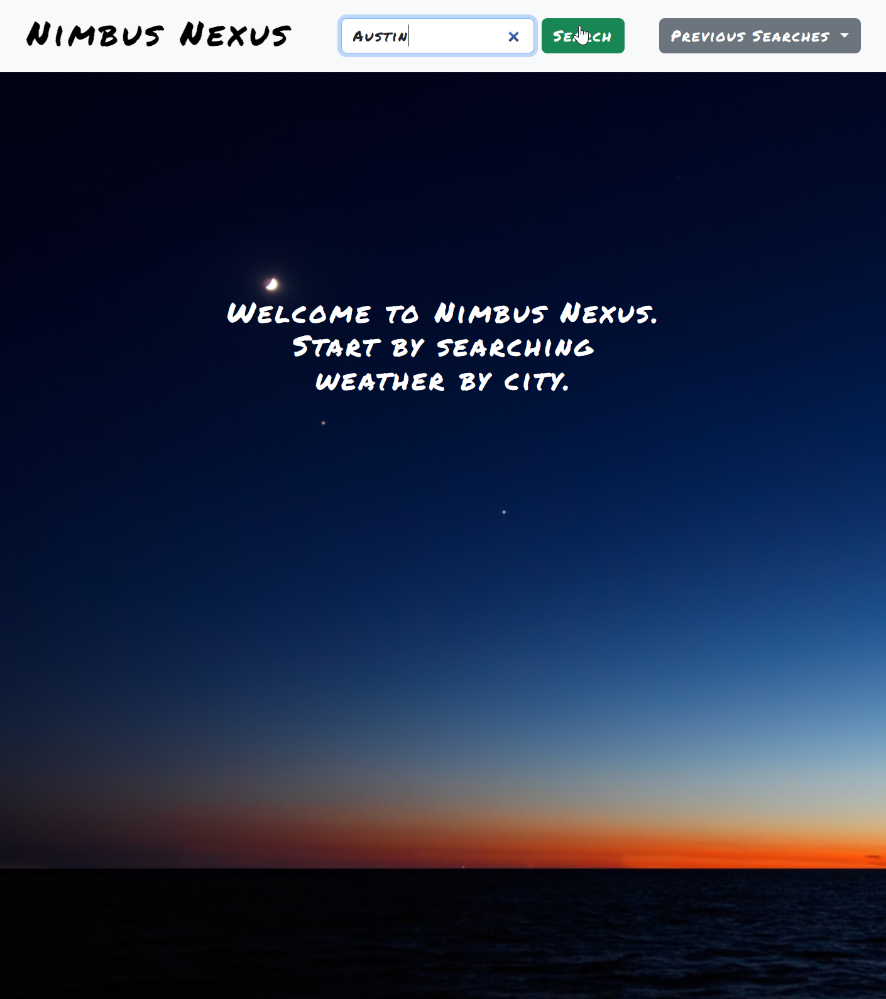
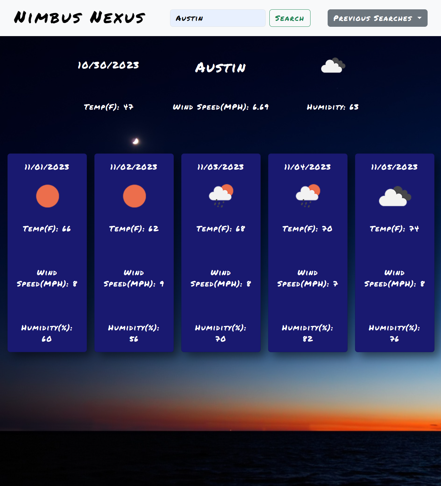
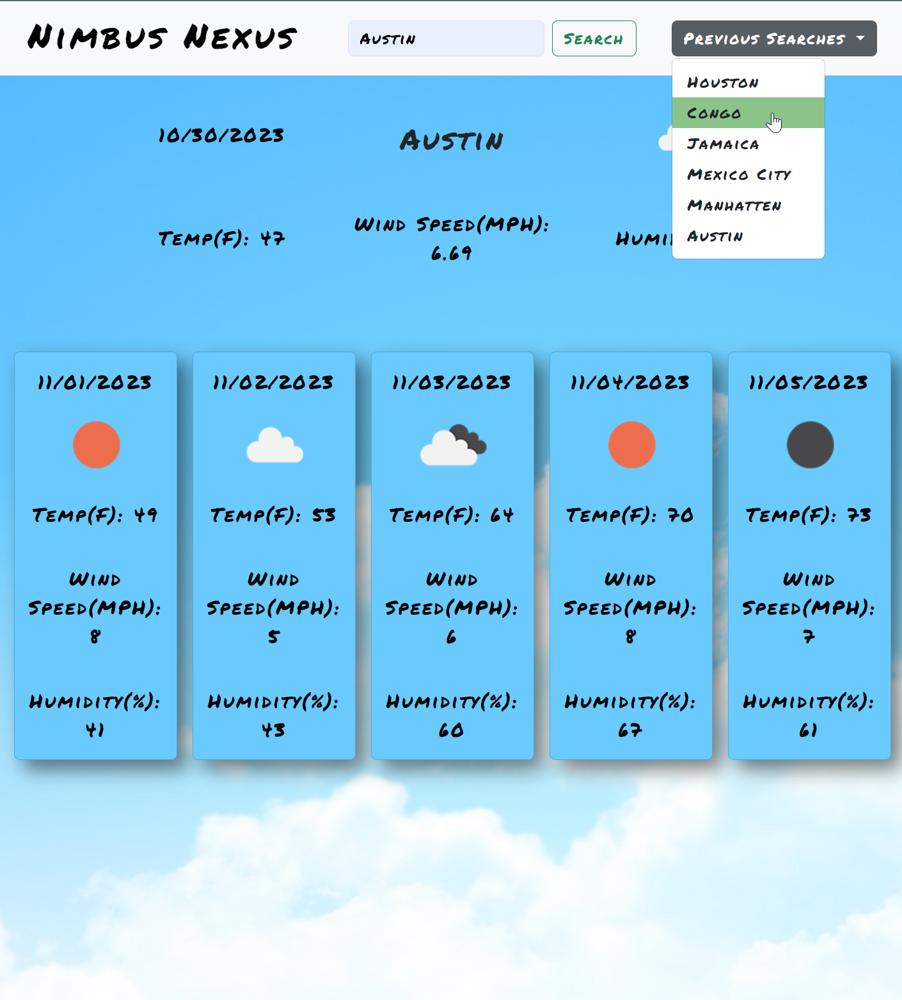

# Nimbus-Nexus

## Description

Nimbus-Nexus is a modern looking weather app that takes on search a single search parameter (the name of a city) and returns the current weather and also a 5 day forecast.

My motivation for this project was to make a simple easy to use place to quickly get updated and accurate weather data. I built this project to gain valuable API call and handling experience. The OpenWeather free API is a great resource to help learn the in's and out's of correct API calls and response handling. It solves the problem of finding the weather quickly. I learned a tremendous amount of things about javascript data handling and manipulation I learned about several built in methods that I did not know how to use such as .reduce(). I also got very valuable experience parsing JSON in return objects.  

## Usage

This site is up at github pages:

https://spencox.github.io/Nimbus-Nexus/

Location in Github Repository:

https://github.com/Spencox/Nimbus-Nexus 

This app has a simple layout with easy user interaction. It contains a search input for the user in the navigation bar at the top of the page. It also has a dropdown menu of previous city searches that can be clicked and immediately pulled up for review.  

Step -1 is to type in the name of the city you ar looking for. The search bar only accepts city with no state. It can however estimate approximate places and return weather from those regions:

After hitting search the page will pull up the current area weather and provide the weather outlook for the next 5 days that includes average temp, wind, speed, and humidity:

The UI will change backgrounds based on if it is day or night where you are accessing your browser from. The pull down menu titled "Previous Searches" will store up to 7 searches that you can click and get updated weather quickly instead of using the search bar: 

## Credits

Coding Boot Camp. (n.d.). Professional Readme Guide. GitHub. https://coding-boot-camp.github.io/full-stack/github/professional-readme-guide

Bootstrap. (n.d.). Getting started with Bootstrap. Bootstrap. https://getbootstrap.com/docs/5.3/getting-started/introduction/

Bootstrap. (n.d). Navbar https://getbootstrap.com/docs/5.3/components/navbar/

OpenWeatherMap. (n.d.). OpenWeatherMap Geocoding API. https://openweathermap.org/api/geocoding-api

OpenWeatherMap. (n.d.) OpenWeatherMap 5 Day Weather Forecast. https://openweathermap.org/forecast5

Mozilla. (n.d.). String.prototype.split(). https://developer.mozilla.org/en-US/docs/Web/JavaScript/Reference/Global_Objects/String/split

YouTube. (Dec 29, 2020). Calculate mean/average using .reduce() | JavaScript Fundamentals. https://www.youtube.com/watch?v=A0AOCBnN8RA

YouTube. (Jul 18, 2020). The Reduce Method | Javascript Fundamentals. https://www.youtube.com/watch?v=NNCVLuqsoMY&list=PLohrXihya73qyrvb93kut-596a6WhzXZ9&index=1

YouTube. (Mar 22, 2022). 5 JavaScript API Key Mistakes (and how to fix them). https://www.youtube.com/watch?v=7oJgdyMS4rQ

YouTube. (Jan 17, 2019). JavaScript Promises In 10 Minutes. https://www.youtube.com/watch?v=DHvZLI7Db8E

Mozilla. (n.d.). Promise. https://developer.mozilla.org/en-US/docs/Web/JavaScript/Reference/Global_Objects/Promise

Mozilla. (n.d.). Fetch API. https://developer.mozilla.org/en-US/docs/Web/API/Fetch_API

WallpapersWide. (n.d.). Clear Blue Sky Panorama. https://wallpaperswide.com/clear_blue_sky_panorama-wallpapers.html#google_vignette

WallpapersWide. (n.d.). Night Sky. https://wallpaperswide.com/night_sky_3-wallpapers.html

RapidTables. (n.d.). CSS Color. https://www.rapidtables.com/web/css/css-color.html